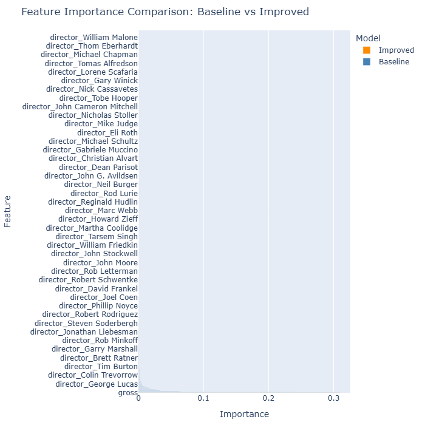
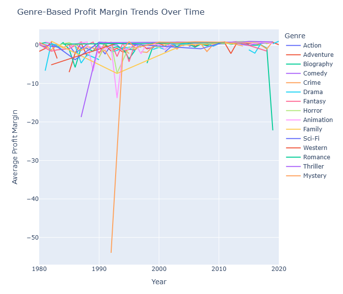

# Which Movie Will Gross More? 🎬  

## Abstract / Overview  
This project is a Python-based Streamlit app that predicts, using **release-time metadata**, which of two user-selected movies will have the higher **inflation-adjusted domestic gross revenue**.  

Studios and producers often need to estimate box office potential before committing to budgets and marketing. Our tool provides a data-driven way to compare movies, reducing financial risk and helping allocate resources more effectively.  

The app uses Kaggle’s *Movie Industry Dataset* by Daniel Grijalvas, covering ~7,600 movies released between 1980–2020. Features include genre, rating, budget, gross revenue, runtime, and release year.  

---

## Stakeholder Use Case
 
- **Studios/Producers** → Compare two movies at the concept stage to guide budget and marketing.  
- **Distributors/Marketers** → Identify trends in what types of films perform better.  
- **Audiences/Researchers** → Explore patterns in movie success across genres, decades, and budgets.  

---

## Data Description 
- **Source**: [Movie Industry Dataset](https://www.kaggle.com/datasets/danielgrijalvas/movies) (Daniel Grijalvas, Kaggle).  
- **Rows**: ~7,600 movies (1980–2020).  
- **Features**:  
  - *Continuous*: Budget (Inflation-Adjusted), Gross (inflation-adjusted), Runtime, Score, Votes
  - *Categorical*: Rating, Genre, Year, Director, Writer, Star, Decade, Company  
- **Cleaning Steps**: 
  * Remove movies where original release was outside US
  * Remove movies where budget or gross was blank
  * Extracted release year from release information (which then provides the decade)
  * Adjust budget and gross for inflation
  * Provide surrogate field for Company and udpate it with company names that that should be grouped - e.g. "Disney Studios" and "Disney Animation" become "Disney"
  * Provide budget and gross in millions and rounded to the nearest to reduce dimensionality
  * Ensured that any one actor, director, or writer was represented with the same spelling throughout the dataset.
- Resulting Dataset:
  * 5075 Records
  * Fields:
    * name
    * rating
    * genre
    * year
    * score
    * votes
    * director
    * writer
    * star
    * runtime
    * decade
    * gross
    * budget
    * company

---

## Roles & Responsibilities  

| Team Member | Role | Responsibilities |  
|-------------|------|------------------|  
| **Shyam** | Project Lead / Backend & Integration | Lead standups, manage GitHub repo, implement predictive model, create Python class, integrate modules, ensure deployment & env files |  
| **Adam** | Data Visualization Lead | Perform EDA, build Streamlit visualizations, integrate into app, support README with plots/screenshots |  
| **Neville** | Data Scientist / Preprocessing | Clean & preprocess dataset (inflation, missing values, encoding), feature engineering, document dataset section, support model training |  
| **Lauren** | Narrative & Documentation Specialist | Draft Abstract/Overview, Stakeholder Impact, Ethical Concerns; write user instructions for Streamlit UI |  
| **Noor** | Software Engineer / UI & Testing | Build Streamlit interface, implement user input & error handling, contribute helper functions, write unittests, ensure app runs end-to-end |  

---

## Contributing Guidelines  
To keep the repo clean and consistent:  
1. **Pull from `main`** before starting work on your branch.  
2. Work in **your personal branch** (e.g., `shyam-dev`, `noor-ui`).  
3. Commit often with clear messages (e.g., `feat: add preprocessing for inflation`).  
4. **Push** your branch regularly.  
5. Open a **Pull Request** into `main` once your code is working.  
6. During standups, we’ll cross off tasks and update roadblocks together.  

---

## Ethical Concerns (to expand later)  
- Dataset bias: focuses only on U.S. domestic box office.  
- Does not account for streaming, global markets, movies which were not initially theatrical releases or post-release reception.  
- Predictions should not be seen as guarantees but as exploratory guidance.

## Visualizations

### Feature Importance Within Our Model

### Genre Profit Margin Trends

## Preliminary Results & Insights
### Exploratory Data Analysis (EDA)
#### Dataset Overview

Source: Daniel Grijalva’s Movies Dataset on Kaggle

Size: 5,000+ movies

Key Features: title, year, genre, duration, rating, votes, gross, director, actors, metascore, description

#### Key Findings
- Gross (domestic revenue) is highly skewed, with a few blockbusters dominating the top end.
- Strong correlation between votes, rating, and gross—popular and well-rated movies tend to earn more.
- Missing values in metascore and gross were handled via median imputation and exclusion where necessary.
- Genre and release year show clustering effects—action and adventure films post-2010 tend to outperform others.

#### Visual Highlights

Revenue distribution by genre and year

Genre vs. average gross revenue

Correlation matrix of numeric features (See /notebooks/EDA.ipynb for full analysis)

#### Baseline Model Performance
Model Used: Logistic Regression (unoptimized)

Goal: Predict which of two movies has the higher domestic gross revenue.

#### Evaluation Metrics

| Metric |	Score |
|:-------|:-------|
|Accuracy |	0.71|
|Precision |	0.73|
|Recall |	0.69|
|F1 Score |	0.71|

#### Observations

- Model performs well when comparing movies with large revenue gaps.
- Struggles with close comparisons, especially among mid-budget dramas and comedies.
- Votes, rating, and year are strong predictors; genre adds nuance but is less consistent.

#### Next Steps
- [x] Normalize revenue by inflation to improve historical comparisons
- [ ] Incorporate cast and director metadata for deeper feature engineering
- [ ] Explore ensemble models (e.g., Random Forest, Gradient Boosting)
- [ ] Build interactive UI for side-by-side movie comparison

### Methodology Description for “Movie Gross” App
#### Overview
Methodology Name: Agile (Scrum-inspired)
Purpose: Deliver a fun, data-driven movie comparison app through rapid iterations and continuous user feedback.
Scope: Streamlit web app development, backend services, and data integration.

#### Core Principles
- Iterative development with short sprints
- Continuous delivery of playable features
- User-centric design and feedback loops
- Cross-functional collaboration
- Embrace change and refine based on analytics

#### Workflow Phases
|Phase Description|	Deliverables|
|:---------------|:-------------|
|Sprint Planning|	Define goals, prioritize backlog items, estimate effort	Sprint backlog|
|Design|	UX/UI mockups app flow, leaderboard concepts	Wireframes, design assets|
|Development|	Implement features (e.g., movie comparison logic, scoring, user profiles)	Code commits, unit tests|
|Testing|	Functional, regression, and usability testing	Test cases, bug reports
|Review|	Demo sprint output, gather feedback from stakeholders	Sprint review notes|
|Retrospective|	Reflect on process, identify improvements	Action items for next sprint|

#### Tools and Artifacts
- Project Management: Github
- Version Control: GitHub
- Design: 
- CI/CD: 
- Data Source: Kaggle

#### Communication and Feedback
Weekly Standups: 30-minute check-ins

Sprint Reviews: Stakeholder demos every week once app is in development

User Feedback: analytics dashboard

Retrospectives: Team-led reflection sessions

#### Metrics and Evaluation
Accuracy of movie data comparisons

Feature adoption

Bug count and resolution time

Sprint velocity

#### Adaptability
Backlog grooming every sprint

Pivot based on stakeholder feedback (e.g., add international gross option)

Feature flags for A/B testing

