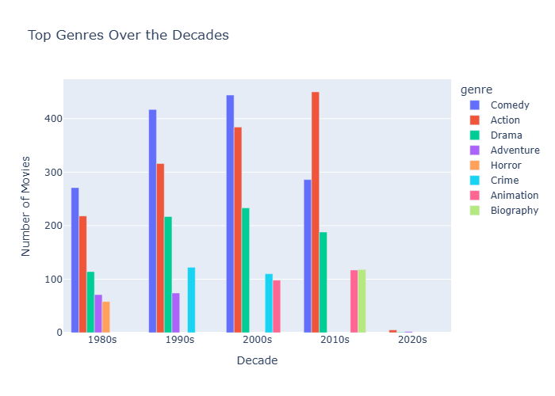
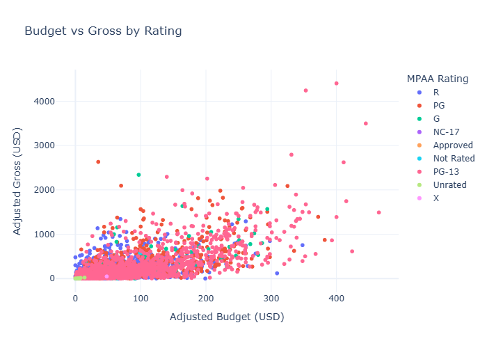

# Which Movie Will Gross More? 🎬  

## Abstract / Overview  
This project is a Python-based Streamlit app that predicts, using **release-time metadata**, which of two user-selected movies will have the higher **inflation-adjusted domestic gross revenue**.  

Studios and producers often need to estimate box office potential before committing to budgets and marketing. Our tool provides a data-driven way to compare movies, reducing financial risk and helping allocate resources more effectively.  

The app uses Kaggle’s *Movie Industry Dataset* by Daniel Grijalvas, covering ~7,600 movies released between 1980–2020. Features include genre, rating, budget, gross revenue, runtime, and release year.  

---

## Stakeholder Use Case
 
- **Studios/Producers** → Compare two movies at the concept stage to guide budget and marketing.  
- **Distributors/Marketers** → Identify trends in what types of films perform better.  
- **Audiences/Researchers** → Explore patterns in movie success across genres, decades, and budgets.  

---

## Data Description (Stub – to be expanded by Neville)  
- **Source**: [Movie Industry Dataset](https://www.kaggle.com/datasets/danielgrijalvas/movies) (Daniel Grijalvas, Kaggle).  
- **Rows**: ~7,600 movies (1980–2020).  
- **Features**:  
  - *Continuous*: Budget, Gross (inflation-adjusted), Runtime.  
  - *Categorical*: Genre, Rating, Year.  
- **Cleaning Steps**: Inflation adjustment, handling missing values, feature encoding (to be documented).  

---

## Roles & Responsibilities  

| Team Member | Role | Responsibilities |  
|-------------|------|------------------|  
| **Shyam** | Project Lead / Backend & Integration | Lead standups, manage GitHub repo, implement predictive model, create Python class, integrate modules, ensure deployment & env files |  
| **Adam** | Data Visualization Lead | Perform EDA, build Streamlit visualizations, integrate into app, support README with plots/screenshots |  
| **Neville** | Data Scientist / Preprocessing | Clean & preprocess dataset (inflation, missing values, encoding), feature engineering, document dataset section, support model training |  
| **Lauren** | Narrative & Documentation Specialist | Draft Abstract/Overview, Stakeholder Impact, Ethical Concerns; write user instructions for Streamlit UI |  
| **Noor** | Software Engineer / UI & Testing | Build Streamlit interface, implement user input & error handling, contribute helper functions, write unittests, ensure app runs end-to-end |  

---

## Contributing Guidelines  
To keep the repo clean and consistent:  
1. **Pull from `main`** before starting work on your branch.  
2. Work in **your personal branch** (e.g., `shyam-dev`, `noor-ui`).  
3. Commit often with clear messages (e.g., `feat: add preprocessing for inflation`).  
4. **Push** your branch regularly.  
5. Open a **Pull Request** into `main` once your code is working.  
6. During standups, we’ll cross off tasks and update roadblocks together.  

---

## Ethical Concerns (to expand later)  
- Dataset bias: focuses only on U.S. domestic box office.  
- Does not account for streaming, global markets, or post-release reception.  
- Predictions should not be seen as guarantees but as exploratory guidance.

## Visualizations

### Genres Over Decades

### Budget vs Adjusted Gross by Rating

